# Arquitectura RAG para n8n con Azure

## 📋 Índice
1. [Componentes de Azure Necesarios](#componentes-de-azure-necesarios)
2. [Arquitectura General](#arquitectura-general)
3. [Flujo 1: Ingesta de Documentos](#flujo-1-ingesta-de-documentos)
4. [Flujo 2: Actualización y Eliminación](#flujo-2-actualización-y-eliminación)
5. [Flujo 3: Consultas RAG](#flujo-3-consultas-rag)
6. [Configuración en n8n](#configuración-en-n8n)

---

## 🔧 Componentes de Azure Necesarios

### **1. Azure OpenAI Service** ⭐ FUNDAMENTAL
**Propósito:** Generar embeddings y respuestas
- **Modelos necesarios:**
  - `text-embedding-ada-002` → Para generar embeddings (vectores) de documentos
  - `gpt-4` o `gpt-4-turbo` → Para generar respuestas aumentadas
  - `gpt-3.5-turbo` → Alternativa más económica para respuestas

**Configuración:**
```
Servicio: Azure OpenAI
Endpoint: https://<tu-recurso>.openai.azure.com/
API Key: [Tu API Key de Azure OpenAI]
Deployment Names: 
  - embedding-deployment-name
  - gpt4-deployment-name
```

### **2. Azure AI Search (antes Cognitive Search)** ⭐ FUNDAMENTAL
**Propósito:** Almacén de vectores + búsqueda híbrida

**Características necesarias:**
- ✅ Vector search habilitado
- ✅ Semantic ranking (opcional pero recomendado)
- ✅ Índice con campos:
  - `id` (string) - Identificador único
  - `content` (string) - Texto del chunk
  - `content_vector` (Collection(Edm.Single)) - Embedding del chunk
  - `metadata` (JSON) - Metadatos del documento
  - `document_id` (string) - ID del documento original
  - `filename` (string) - Nombre del archivo
  - `chunk_index` (int) - Número del chunk
  - `created_at` (datetime)
  - `updated_at` (datetime)

**Configuración:**
```
Servicio: Azure AI Search
Endpoint: https://<tu-servicio>.search.windows.net
API Key: [Tu Search API Key]
Índice: rag-documents
```

### **3. Azure Blob Storage** ⭐ FUNDAMENTAL
**Propósito:** Almacenar documentos originales

**Estructura de contenedores:**
```
├── raw-documents/          # Documentos originales
│   ├── documento1.pdf
│   └── documento2.docx
├── processed-documents/    # Documentos ya procesados
│   └── metadata/
│       ├── documento1.json  # Metadata de procesamiento
│       └── documento2.json
└── deleted-documents/      # Respaldo de eliminados
    └── 2025-10/
        └── documento-antiguo.pdf
```

**Configuración:**
```
Servicio: Azure Blob Storage
Connection String: [Tu connection string]
Contenedores: raw-documents, processed-documents, deleted-documents
```

### **4. Azure Cosmos DB (Opcional pero RECOMENDADO)**
**Propósito:** Base de datos de metadatos y tracking

**Colecciones:**
```javascript
// documents_metadata
{
  "id": "doc_12345",
  "filename": "contrato_cliente_x.pdf",
  "blob_url": "https://...",
  "upload_date": "2025-10-21T10:00:00Z",
  "processed_date": "2025-10-21T10:01:23Z",
  "status": "processed", // pending, processing, processed, failed
  "chunks_count": 15,
  "chunk_ids": ["chunk_1", "chunk_2", ...],
  "search_index_ids": ["idx_1", "idx_2", ...],
  "metadata": {
    "type": "contract",
    "department": "legal",
    "tags": ["cliente_x", "2025"]
  },
  "hash": "sha256_hash_del_documento" // Para detectar duplicados
}

// query_history (Auditoría)
{
  "id": "query_789",
  "query": "¿Cuál es el plazo del contrato?",
  "timestamp": "2025-10-21T11:30:00Z",
  "user_id": "user@banco.com",
  "results_count": 5,
  "response": "El plazo del contrato es...",
  "sources": ["doc_12345"],
  "execution_time_ms": 1234
}
```

**Configuración:**
```
Servicio: Azure Cosmos DB (API SQL/NoSQL)
Endpoint: https://<tu-cosmos>.documents.azure.com:443/
Key: [Tu Cosmos Key]
Database: rag-system
Containers: documents_metadata, query_history
```

### **5. Azure Document Intelligence (Form Recognizer)**
**Propósito:** Extraer texto de PDFs, imágenes, formularios

**Casos de uso:**
- PDFs escaneados (OCR)
- Facturas estructuradas
- Formularios
- Documentos con tablas complejas

**Configuración:**
```
Servicio: Azure AI Document Intelligence
Endpoint: https://<tu-recurso>.cognitiveservices.azure.com/
API Key: [Tu Form Recognizer Key]
Modelo: prebuilt-read (para texto general)
```

### **6. Azure Functions (Opcional)**
**Propósito:** Procesamiento serverless para tareas pesadas

**Funciones útiles:**
- `process-document` → Chunking y embedding en background
- `cleanup-old-documents` → Limpieza automática programada
- `reindex-documents` → Reindexación masiva

---

## 🏗️ Arquitectura General

```
┌─────────────────────────────────────────────────────────────┐
│                         n8n Workflows                         │
├─────────────────────────────────────────────────────────────┤
│                                                               │
│  ┌──────────────┐    ┌──────────────┐    ┌──────────────┐  │
│  │   Ingesta    │    │ Actualización│    │   Consulta   │  │
│  │  Documentos  │    │   y Delete   │    │     RAG      │  │
│  └──────┬───────┘    └──────┬───────┘    └──────┬───────┘  │
│         │                   │                    │           │
└─────────┼───────────────────┼────────────────────┼───────────┘
          │                   │                    │
          ▼                   ▼                    ▼
┌─────────────────────────────────────────────────────────────┐
│                      Azure Services                          │
├─────────────────────────────────────────────────────────────┤
│                                                               │
│  ┌────────────┐   ┌──────────────┐   ┌──────────────────┐  │
│  │   Blob     │   │    Azure     │   │  Azure OpenAI    │  │
│  │  Storage   │◄──┤  AI Search   │◄──┤   Embeddings     │  │
│  └────────────┘   └──────────────┘   └──────────────────┘  │
│                            ▲                                 │
│                            │                                 │
│                    ┌───────┴────────┐                        │
│                    │  Cosmos DB     │                        │
│                    │   Metadata     │                        │
│                    └────────────────┘                        │
└─────────────────────────────────────────────────────────────┘
```

---

## 📥 Flujo 1: Ingesta de Documentos

### **Objetivo:** Procesar documentos nuevos y almacenarlos en el RAG

### **Pasos del Workflow en n8n:**

```mermaid
graph LR
    A[Trigger<br/>Webhook/Email/Blob] --> B[Validar Documento]
    B --> C{¿Ya existe?}
    C -->|Sí| D[Retornar duplicado]
    C -->|No| E[Subir a Blob Storage]
    E --> F[Extraer Texto]
    F --> G[Dividir en Chunks]
    G --> H[Generar Embeddings]
    H --> I[Indexar en AI Search]
    I --> J[Guardar Metadata<br/>en Cosmos]
    J --> K[Notificar Éxito]
```



### **Nodos n8n detallados:**

1. **Trigger (Webhook/Email/Scheduled)**
   - Tipo: `Webhook` o `Microsoft Outlook Trigger` o `Azure Blob Storage Trigger`
   - Input: Documento (PDF, DOCX, TXT)

2. **Validar y Hash del Documento**
   - Tipo: `Code (JavaScript)`
   - Función: Calcular SHA-256 hash para detectar duplicados
   ```javascript
   const crypto = require('crypto');
   const file = items[0].binary.data;
   const hash = crypto.createHash('sha256').update(file.data).digest('hex');
   return [{ json: { ...items[0].json, document_hash: hash } }];
   ```

3. **Verificar Duplicados en Cosmos DB**
   - Tipo: `HTTP Request` → Cosmos DB Query API
   - Query: `SELECT * FROM c WHERE c.hash = '${hash}'`

4. **Subir a Azure Blob Storage**
   - Tipo: `HTTP Request` → Azure Blob REST API
   - Container: `raw-documents`
   - Path: `${fecha}/${filename}`

5. **Extraer Texto**
   - **Opción A:** Azure Document Intelligence (para PDFs complejos)
     - Tipo: `HTTP Request` → Form Recognizer API
     - Endpoint: `/formrecognizer/documentModels/prebuilt-read:analyze`
   
   - **Opción B:** Librería Python (para texto simple)
     - Tipo: `Execute Command` → Python script con PyPDF2/pdfplumber

6. **Dividir en Chunks (Text Splitter)**
   - Tipo: `Code (JavaScript)`
   - Estrategia: Chunks de ~500 tokens con overlap de 50
   ```javascript
   const chunkSize = 500;
   const overlap = 50;
   const text = items[0].json.extracted_text;
   
   const chunks = [];
   let start = 0;
   let index = 0;
   
   while (start < text.length) {
     const end = Math.min(start + chunkSize, text.length);
     chunks.push({
       chunk_index: index++,
       content: text.substring(start, end),
       document_id: items[0].json.document_id,
       metadata: items[0].json.metadata
     });
     start = end - overlap;
   }
   
   return chunks.map(c => ({ json: c }));
   ```

7. **Generar Embeddings con Azure OpenAI**
   - Tipo: `HTTP Request` (Loop sobre chunks)
   - Endpoint: `https://<recurso>.openai.azure.com/openai/deployments/<embedding-model>/embeddings`
   - Headers: `api-key: ${AZURE_OPENAI_KEY}`
   - Body:
   ```json
   {
     "input": "{{ $json.content }}",
     "model": "text-embedding-ada-002"
   }
   ```

8. **Indexar en Azure AI Search**
   - Tipo: `HTTP Request` → POST batch
   - Endpoint: `https://<search>.search.windows.net/indexes/rag-documents/docs/index`
   - Body:
   ```json
   {
     "value": [
       {
         "@search.action": "upload",
         "id": "{{ $json.chunk_id }}",
         "content": "{{ $json.content }}",
         "content_vector": {{ $json.embedding }},
         "document_id": "{{ $json.document_id }}",
         "filename": "{{ $json.filename }}",
         "chunk_index": {{ $json.chunk_index }},
         "metadata": {{ $json.metadata }}
       }
     ]
   }
   ```

9. **Guardar Metadata en Cosmos DB**
   - Tipo: `HTTP Request` → POST document
   - Endpoint: Cosmos DB REST API
   - Body: documento completo con metadata

10. **Notificación de Éxito**
    - Tipo: `Microsoft Outlook` (Send Email) o `Webhook`

---

## 🔄 Flujo 2: Actualización y Eliminación

### **Escenarios:**

#### **A) Actualización de Documento (Reemplazar)**

```mermaid
graph LR
    A[Trigger: Nuevo archivo<br/>mismo nombre] --> B[Buscar doc_id<br/>por filename]
    B --> C[Eliminar chunks<br/>del índice]
    C --> D[Mover blob antiguo<br/>a backup]
    D --> E[Ejecutar Ingesta<br/>del nuevo]
```



**Nodos clave:**
1. **Buscar documento existente** → Cosmos DB Query
2. **Eliminar del Search Index** → Azure AI Search DELETE
   ```json
   {
     "value": [
       {
         "@search.action": "delete",
         "id": "chunk_id_1"
       },
       ...
     ]
   }
   ```
3. **Mover blob a backup** → Azure Blob Copy + Delete
4. **Trigger flujo de ingesta** → Call Workflow

#### **B) Eliminación Lógica (Soft Delete)**

```mermaid
graph LR
    A[Trigger: Solicitud<br/>de eliminación] --> B[Buscar doc_id]
    B --> C[Marcar deleted=true<br/>en Cosmos]
    C --> D[Opcional: Eliminar<br/>del índice]
    D --> E[Mover blob a<br/>deleted-documents]
```



**Ventaja:** Permite rollback y auditoría

#### **C) Eliminación Física (Hard Delete)**


### **Código para Eliminar por document_id:**

```javascript
// Nodo: Code - Obtener todos los chunk IDs
const documentId = items[0].json.document_id;

// Query a Cosmos para obtener metadata
const metadata = items[0].json.cosmos_document;
const chunkIds = metadata.search_index_ids;

// Preparar batch delete para Azure Search
const deleteActions = chunkIds.map(id => ({
  '@search.action': 'delete',
  'id': id
}));

return [{ 
  json: { 
    document_id: documentId,
    delete_batch: { value: deleteActions },
    blob_path: metadata.blob_url
  } 
}];
```

---

## 🔍 Flujo 3: Consultas RAG

### **Arquitectura de Consulta:**

```mermaid
graph TB
    A[Usuario: Pregunta] --> B[n8n: Recibir query]
    B --> C[Generar embedding<br/>de la pregunta]
    C --> D[Búsqueda vectorial<br/>en AI Search]
    D --> E[Obtener top-K<br/>documentos relevantes]
    E --> F[Construir prompt<br/>con contexto]
    F --> G[Azure OpenAI<br/>GPT-4: Generar respuesta]
    G --> H[Guardar en<br/>query_history]
    H --> I[Retornar respuesta<br/>+ fuentes]
```



### **Nodos n8n detallados:**

1. **Trigger (Webhook/Chat Interface)**
   - Tipo: `Webhook`
   - Input: `{ "query": "¿Cuál es el plazo del contrato X?" }`

2. **Generar Embedding de la Pregunta**
   - Tipo: `HTTP Request` → Azure OpenAI Embeddings
   ```json
   {
     "input": "{{ $json.query }}",
     "model": "text-embedding-ada-002"
   }
   ```

3. **Búsqueda Vectorial en Azure AI Search**
   - Tipo: `HTTP Request` → POST search
   - Endpoint: `https://<search>.search.windows.net/indexes/rag-documents/docs/search`
   - Body:
   ```json
   {
     "search": "*",
     "vectorQueries": [
       {
         "kind": "vector",
         "vector": [/* embedding de la pregunta */],
         "fields": "content_vector",
         "k": 5
       }
     ],
     "select": "content,document_id,filename,metadata",
     "top": 5
   }
   ```

4. **Construir Contexto para el Prompt**
   - Tipo: `Code (JavaScript)`
   ```javascript
   const results = items[0].json.value; // Resultados de AI Search
   
   const context = results.map((r, i) => 
     `[Documento ${i+1}: ${r.filename}]\n${r.content}`
   ).join('\n\n---\n\n');
   
   const sources = results.map(r => ({
     filename: r.filename,
     document_id: r.document_id
   }));
   
   return [{
     json: {
       query: items[0].json.query,
       context: context,
       sources: sources
     }
   }];
   ```

5. **Generar Respuesta con Azure OpenAI GPT-4**
   - Tipo: `HTTP Request` → Azure OpenAI Chat Completions
   - Endpoint: `https://<recurso>.openai.azure.com/openai/deployments/<gpt4-deployment>/chat/completions`
   - Body:
   ```json
   {
     "messages": [
       {
         "role": "system",
         "content": "Eres un asistente experto del Banco Caja Social. Responde basándote ÚNICAMENTE en el contexto proporcionado. Si la información no está en el contexto, di que no tienes esa información."
       },
       {
         "role": "user",
         "content": "Contexto:\n{{ $json.context }}\n\nPregunta: {{ $json.query }}"
       }
     ],
     "temperature": 0.3,
     "max_tokens": 800
   }
   ```

6. **Auditoría: Guardar en Cosmos DB**
   - Tipo: `HTTP Request` → Cosmos DB
   - Container: `query_history`

7. **Respuesta Final**
   - Tipo: `Respond to Webhook`
   - Body:
   ```json
   {
     "answer": "{{ $json.openai_response }}",
     "sources": {{ $json.sources }},
     "timestamp": "{{ $now }}"
   }
   ```

---

## ⚙️ Configuración en n8n

### **Credenciales a Configurar:**

1. **Azure OpenAI**
   - Settings → Credentials → Add
   - Type: `HTTP Request`
   - Name: `Azure OpenAI`
   - Auth: `Generic Credential Type`
   - Headers:
     ```
     api-key: <TU_AZURE_OPENAI_KEY>
     Content-Type: application/json
     ```

2. **Azure AI Search**
   - Type: `HTTP Request`
   - Headers:
     ```
     api-key: <TU_SEARCH_KEY>
     Content-Type: application/json
     ```

3. **Azure Blob Storage**
   - Type: `HTTP Request` con Shared Key Authentication
   - O usar SDK de Azure en nodos de Code

4. **Azure Cosmos DB**
   - Type: `HTTP Request`
   - Headers:
     ```
     x-ms-version: 2018-12-31
     Authorization: <COSMOS_MASTER_KEY>
     ```

### **Variables de Entorno (n8n):**

```env
AZURE_OPENAI_ENDPOINT=https://<recurso>.openai.azure.com
AZURE_OPENAI_KEY=<key>
AZURE_OPENAI_EMBEDDING_DEPLOYMENT=text-embedding-ada-002
AZURE_OPENAI_GPT_DEPLOYMENT=gpt-4

AZURE_SEARCH_ENDPOINT=https://<search>.search.windows.net
AZURE_SEARCH_KEY=<key>
AZURE_SEARCH_INDEX=rag-documents

AZURE_BLOB_CONNECTION_STRING=<connection-string>

COSMOS_DB_ENDPOINT=https://<cosmos>.documents.azure.com:443/
COSMOS_DB_KEY=<key>
COSMOS_DB_DATABASE=rag-system
```

---

## 📊 Resumen de Costos Estimados (Azure)

| Servicio | Tier Recomendado | Costo Mensual Aprox. |
|----------|------------------|---------------------|
| Azure OpenAI | Pay-as-you-go | $50-200 (según volumen) |
| Azure AI Search | Standard S1 | $250 |
| Blob Storage | Standard LRS | $5-20 |
| Cosmos DB | Serverless | $10-50 |
| Document Intelligence | Standard S0 | $25 (1000 pages/mes) |
| **Total Estimado** | | **$340-545/mes** |

---

## 🚀 Próximos Pasos

1. ✅ **Provisionar servicios en Azure**
2. ✅ **Configurar credenciales en n8n**
3. ✅ **Crear índice en Azure AI Search**
4. ✅ **Crear containers en Cosmos DB**
5. ✅ **Implementar Flujo 1: Ingesta**
6. ✅ **Implementar Flujo 3: Consultas**
7. ✅ **Implementar Flujo 2: Actualización/Eliminación**
8. ✅ **Pruebas y Optimización**

---

¿Quieres que empiece a crear los workflows en JSON para importarlos directamente a tu n8n?

